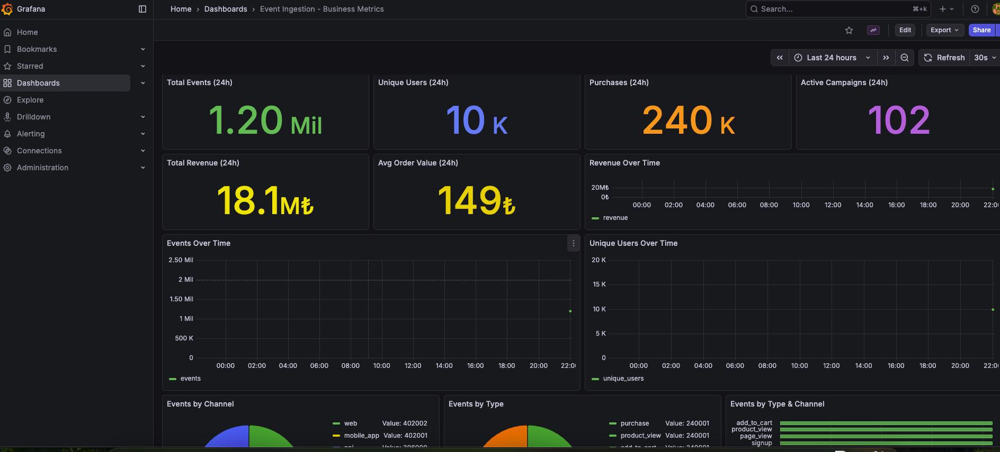

# Event Ingestion System DDD

High-throughput event ingestion and metric aggregation system built with Go, Kafka, and ClickHouse.

## Quick Start

### Prerequisites

- Go 1.22+
- Docker & Docker Compose

### Run

```bash
make run
```

This starts Kafka, ClickHouse, and the application.

### Stop

```bash
make stop
```

## Architecture

```
┌─────────────┐     ┌──────────────────┐     ┌─────────────────┐     ┌──────────────┐
│  HTTP API   │────▶│  Kafka Cluster   │────▶│  Consumer Pool  │────▶│  ClickHouse  │
│  (Fiber)    │     │  (2 brokers)     │     │  (20 workers)   │     │              │
                        20 partition
└─────────────┘     └──────────────────┘     └─────────────────┘     └──────────────┘
      │                                                                │
      │                                                                │
      └────────────────────────GET /metrics────────────────────────────┘
```

### Kafka Cluster Configuration

| Topic | Partitions | Replication Factor | Description |
|-------|------------|-------------------|-------------|
| events | 20 | 2 | Main event topic |
| events.retry | 10 | 2 | Failed events for retry |
| events.dlq | 5 | 2 | Dead letter queue |

- **2 Brokers**: High availability with automatic failover
- **Replication Factor 2**: Every message stored on both brokers
- **Min In-Sync Replicas**: All replicas must be in sync
- **20 Consumers**: Same consumer group with 20 active consumers for parallel processing

> **Note on Scaling**: Initially considered Kubernetes deployment with HPA (Horizontal Pod Autoscaler) for instance-based scaling, but decided against it to avoid overengineering. The current single-instance setup with 20 internal consumers is sufficient for the target throughput.

### Key Design Decisions

- **DDD Architecture**: Domain-Driven Design with clear layer separation
- **CQRS Pattern**: Command Query Responsibility Segregation for separate read/write models
- **Kafka for Async Processing**: Events are immediately queued for processing
- **ClickHouse for Analytics**: Optimized for high-volume time-series data and aggregations
- **Batch Processing**: Workers accumulate events (2000 or 50ms timeout) before inserting
- **Idempotency**: Event ID generated from SHA256(event_name + user_id + timestamp + channel)
- **Exponential Backoff**: Retry delays increase exponentially (2s, 4s, 8s, 16s, 32s, max 60s)

### Project Structure

```
event-ingestion/
├── domain/
│   └── event/
│       ├── event.go           # Entity with validation
│       ├── command.go         # Write commands (CQRS)
│       ├── query.go           # Read queries (CQRS)
│       ├── repository.go      # Repository interface
│       ├── event_test.go      # Unit tests
│       └── errors.go          # Domain errors
├── application/
│   ├── event_service.go       # Event ingestion use cases
│   ├── event_service_test.go  # Unit tests
│   ├── metrics_service.go     # Metrics query use cases
│   ├── metrics_service_test.go # Unit tests
│   └── dto/                   # Data Transfer Objects
├── infrastructure/
│   ├── config/                # Configuration
│   ├── persistence/
│   │   └── clickhouse/        # ClickHouse repository implementation
│   └── messaging/
│       ├── kafka/             # Kafka producer
│       └── worker/            # Kafka consumers (main, retry)
├── presentation/
│   └── api/
│       ├── controller/        # HTTP handlers
│       └── middleware/        # Logging, recovery
├── scripts/
│   └── loadtest.go            # Load testing script
├── assets/                    # Example HTTP requests
├── mocks/                     # Mock implementations for testing
├── docs/                      # Swagger documentation
├── grafana/                   # Grafana dashboards & provisioning
├── main.go                    # Entry point
├── Dockerfile
├── docker-compose.yml
└── README.md
```

### ClickHouse Schema Design

```
┌─────────────────┐      ┌──────────────────────┐      ┌─────────────────┐
│     events      │──MV──│   events_hourly_mv   │─────▶│  events_hourly  │
│ (ReplacingMT)   │      │  (Materialized View) │      │ (AggregatingMT) │
└─────────────────┘      └──────────────────────┘      └─────────────────┘
        │                                                       │
        │                                                       │
   INSERT here                                          SELECT from here
   (raw events)                                         (metrics queries)
```

**ClickHouse Connection:**

| Property | Value |
|----------|-------|
| JDBC URL | `jdbc:clickhouse://localhost:8123/event_ingestion` |
| Username | `default` |
| Password | `clickhouse123` |

### Performance Targets

- Average: ~2,000 events/second
- Peak: ~20,000 events/second

### Service URLs

| Service | URL | Credentials |
|---------|-----|-------------|
| API | http://localhost:8080 | - |
| Swagger UI | http://localhost:8080/swagger/index.html | - |
| Kafka UI | http://localhost:9090 | - |
| Grafana | http://localhost:3000 | admin / admin |

## Grafana Dashboard

Real-time business metrics dashboard powered by ClickHouse.



### Dashboard Panels

| Panel | Description |
|-------|-------------|
| Total Events (24h) | Total event count in last 24 hours |
| Unique Users (24h) | Unique user count in last 24 hours |
| Purchases (24h) | Total purchase events |
| Active Campaigns (24h) | Number of active campaigns |
| Total Revenue (24h) | Total revenue from purchases (TRY) |
| Unique Users Over Time | Hourly unique user trend |
| Revenue Over Time | Hourly revenue trend |
| Events by Channel | Distribution by web, mobile_app, api |


### Access

```
URL: http://localhost:3000
Username: admin
Password: admin
Dashboard: "Event Ingestion - Business Metrics"
```

## API Endpoints

| Method | Path | Description |
|--------|------|-------------|
| POST | /api/v1/events | Ingest single event |
| POST | /api/v1/events/bulk | Ingest bulk events (max 1000) |
| GET | /api/v1/metrics | Query aggregated metrics |
| GET | /health | Health check |
| GET | /swagger/* | Swagger UI |

## Example Requests

Example HTTP requests can be found in the `assets/` directory. For load testing, see `scripts/load_test.go`.

### Ingest Single Event

```bash
# Note: Use a recent timestamp (within last 30 days, not in the future)
# Example: $(date +%s) for current time
curl -X POST http://localhost:8080/api/v1/events \
  -H "Content-Type: application/json" \
  -d '{
    "event_name": "product_view",
    "channel": "web",
    "campaign_id": "cmp_987",
    "user_id": "user_123",
    "timestamp": '"$(date +%s)"',
    "tags": ["electronics", "homepage"],
    "metadata": {
      "product_id": "prod-789",
      "price": 129.99,
      "currency": "TRY",
      "referrer": "google"
    }
  }'
```

**Response (202 Accepted):**
```json
{
  "event_id": "a1b2c3d4e5f6...",
  "status": "queued"
}
```

### Ingest Bulk Events

```bash
# Note: Use recent timestamps (within last 30 days)
curl -X POST http://localhost:8080/api/v1/events/bulk \
  -H "Content-Type: application/json" \
  -d '{
    "events": [
      {
        "event_name": "product_view",
        "user_id": "user_123",
        "timestamp": '"$(date +%s)"',
        "channel": "web"
      },
      {
        "event_name": "add_to_cart",
        "user_id": "user_456",
        "timestamp": '"$(date +%s)"',
        "channel": "mobile_app"
      }
    ]
  }'
```


### Query Metrics

```bash
# Get timestamps for last 24 hours
FROM=$(date -v-24H +%s)  # or: FROM=$(($(date +%s) - 86400))
TO=$(date +%s)

# Basic query
curl "http://localhost:8080/api/v1/metrics?event_name=product_view&from=$FROM&to=$TO"

# With channel filter
curl "http://localhost:8080/api/v1/metrics?event_name=product_view&from=$FROM&to=$TO&channel=web"

# With grouping by channel
curl "http://localhost:8080/api/v1/metrics?event_name=product_view&from=$FROM&to=$TO&group_by=channel"

# With grouping by hour
curl "http://localhost:8080/api/v1/metrics?event_name=product_view&from=$FROM&to=$TO&group_by=hour"
```

**Response:**
```json
{
  "total_count": 15000,
  "unique_users": 3500,
  "grouped_data": [
    {"key": "web", "total_count": 10000, "unique_users": 2500},
    {"key": "mobile_app", "total_count": 5000, "unique_users": 1000}
  ]
}
```

## Validation Rules

| Field | Rule |
|-------|------|
| event_name | Required, 1-100 characters |
| user_id | Required, 1-100 characters |
| timestamp | Required, Unix epoch, cannot be in the future, max 30 days old |
| channel | Optional, one of: web, mobile_app, api |
| tags | Optional, max 20 items, each max 100 characters |
| metadata | Optional, free-form JSON object |
